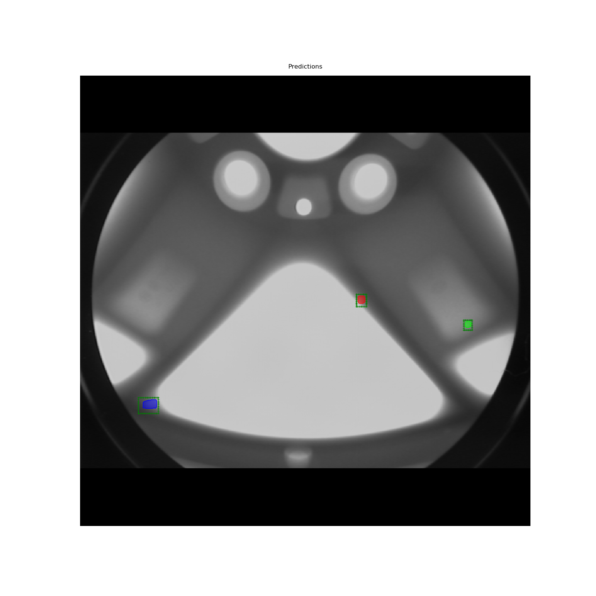
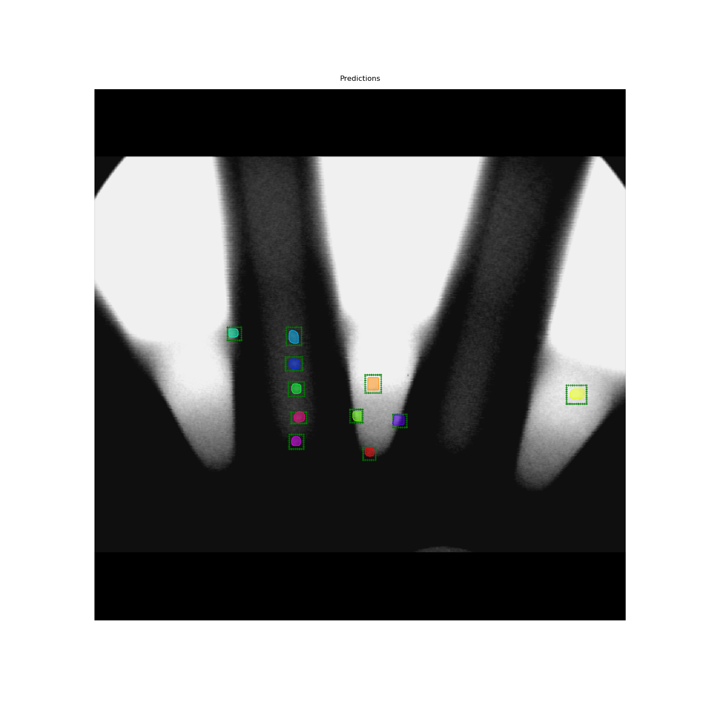
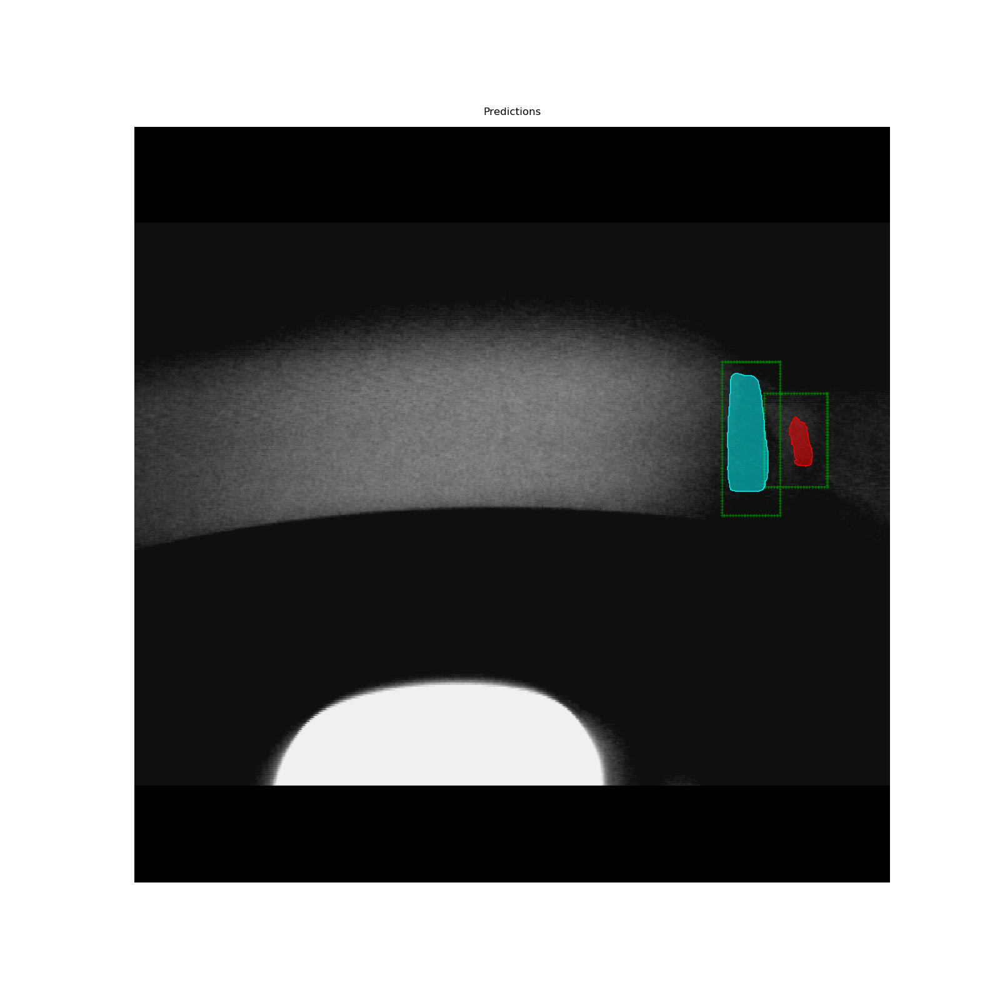
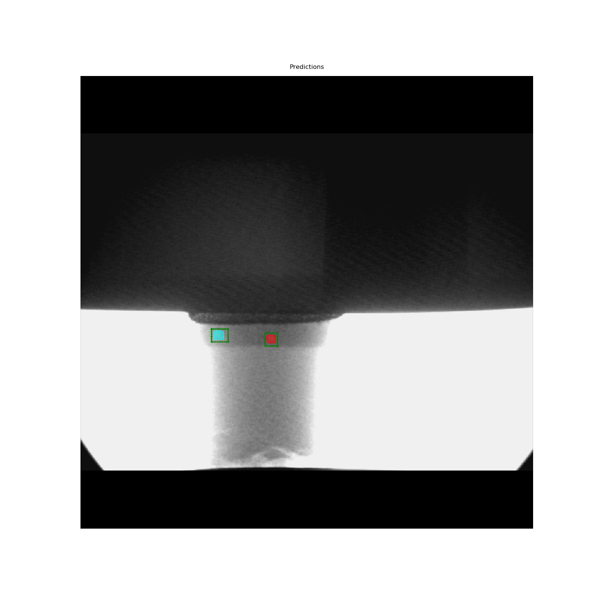

# Training a Mask R-CNN model to find defects in Xray Images

This project trains a Mask R-CNN model written in Keras/TensorFlow to find defects in Xray Images. 

It reuses all of the code available [here](https://github.com/matterport/Mask_RCNN) (additionally, refactoring for modularity). Training script available at 

`mask-r-cnn/samples/gdxray/run_train.sh` Hit me up if you want the mask-annotated training data to improve the results. 

Sample results are shown below. Each instance of a predicted mask is color-coded. The dashed bounding-box (in green) is the bounding-box ground-truth. 

  
   

  
   

<!--
 

-->

All the of customization needed to train and evaluate the model is in in the folder, `mask-r-cnn/samples/gdxray/`

